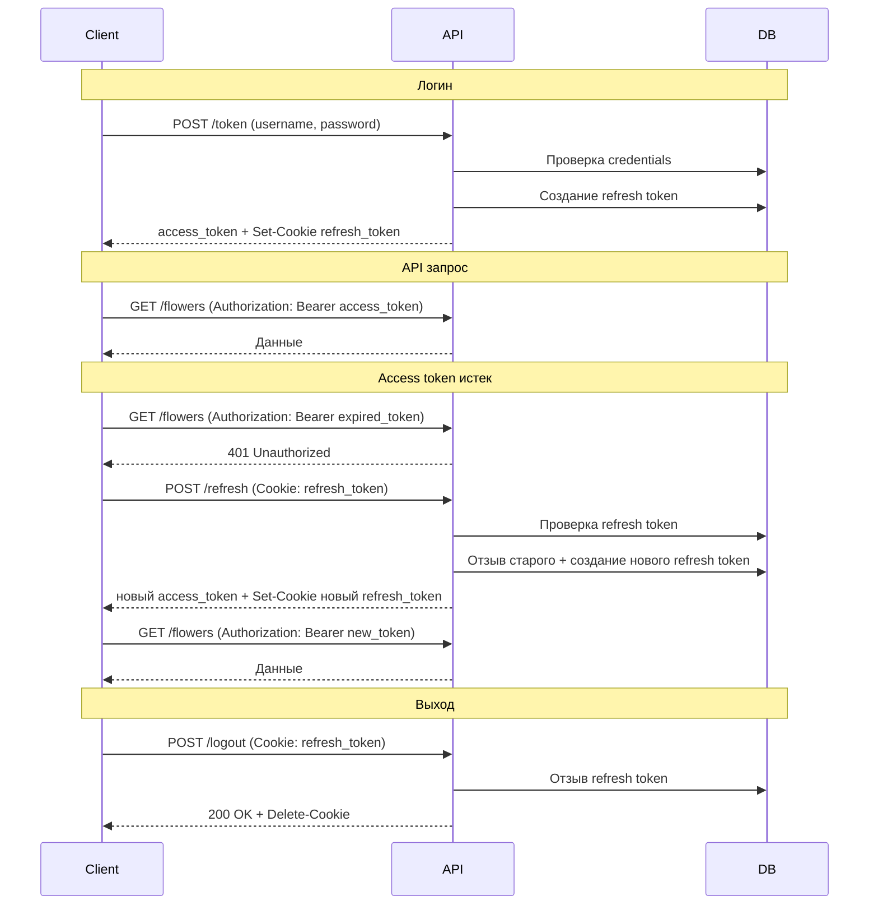

# План реализации: Редактирование клиентов и Refresh Token

## Обзор

**Часть 1:** Редактирование клиентов в админ-панели (только Frontend, backend уже готов)
**Часть 2:** Refresh Token с HttpOnly Cookie (Access: 15 мин, Refresh: 30 дней)

---

## Часть 1: Редактирование клиентов (Frontend)

### 1.1 Добавить модальное окно в admin.html

**Файл:** `app/static/admin.html`

Добавить после `#edit-flower-modal` (строка ~162):

```html
<div id="edit-customer-modal" class="modal">
    <div class="modal-content">
        <span class="close-button">&times;</span>
        <h2>✏️ Редактировать клиента</h2>
        <form id="edit-customer-form">
            <input type="hidden" id="edit-customer-id">
            <div class="form-group">
                <label for="edit-customer-contact-name">Контактное лицо / Компания</label>
                <input type="text" id="edit-customer-contact-name" required>
            </div>
            <div class="form-group">
                <label for="edit-customer-address">Адрес доставки</label>
                <textarea id="edit-customer-address"></textarea>
            </div>
            <div class="form-group">
                <label for="edit-customer-admin-notes">Заметки администратора</label>
                <textarea id="edit-customer-admin-notes"></textarea>
            </div>
            <div class="form-group">
                <label for="edit-customer-password">Новый пароль (оставьте пустым, если не меняете)</label>
                <input type="password" id="edit-customer-password" placeholder="Минимум 3 символа">
            </div>
            <button type="submit">💾 Сохранить изменения</button>
        </form>
    </div>
</div>
```

### 1.2 Добавить кнопку редактирования в карточку клиента

**Файл:** `app/static/js/admin/customers.js`

В функции `fetchCustomers()` добавить кнопку редактирования рядом с кнопкой удаления:

```javascript
<button class="edit-customer-btn icon-btn" data-id="${customer.id}" title="Редактировать">✏️</button>
<button class="delete-customer-btn icon-btn" data-id="${customer.id}" data-name="${customer.contact_name}" title="Удалить">🗑</button>
```

### 1.3 Реализовать логику редактирования

**Файл:** `app/static/js/admin/customers.js`

Добавить функции:

```javascript
// DOM элементы
let editCustomerModal = null;
let editCustomerForm = null;

// В initCustomersModule()
editCustomerModal = document.getElementById('edit-customer-modal');
editCustomerForm = document.getElementById('edit-customer-form');

if (editCustomerForm) {
    editCustomerForm.addEventListener('submit', updateCustomer);
}

// Закрытие модального окна
const closeButtons = document.querySelectorAll('#edit-customer-modal .close-button');
closeButtons.forEach(btn => btn.addEventListener('click', closeEditCustomerModal));

window.addEventListener('click', (event) => {
    if (event.target === editCustomerModal) {
        closeEditCustomerModal();
    }
});

// Функции
export function openEditCustomerModal(customer) {
    document.getElementById('edit-customer-id').value = customer.id;
    document.getElementById('edit-customer-contact-name').value = customer.contact_name || '';
    document.getElementById('edit-customer-address').value = customer.address || '';
    document.getElementById('edit-customer-admin-notes').value = customer.admin_notes || '';
    document.getElementById('edit-customer-password').value = '';
    
    if (editCustomerModal) {
        editCustomerModal.classList.add('is-open');
    }
}

export function closeEditCustomerModal() {
    if (editCustomerModal) {
        editCustomerModal.classList.remove('is-open');
    }
}

async function updateCustomer(event) {
    event.preventDefault();
    
    const customerId = document.getElementById('edit-customer-id').value;
    const updatedData = {
        contact_name: document.getElementById('edit-customer-contact-name').value,
        address: document.getElementById('edit-customer-address').value,
        admin_notes: document.getElementById('edit-customer-admin-notes').value,
    };
    
    const newPassword = document.getElementById('edit-customer-password').value;
    if (newPassword) {
        updatedData.password = newPassword;
    }

    try {
        await apiFetch(`/users/${customerId}`, {
            method: 'PUT',
            body: JSON.stringify(updatedData)
        });
        closeEditCustomerModal();
        fetchCustomers();
    } catch (error) {
        console.error('Failed to update customer:', error);
        alert(`Ошибка: ${error.message}`);
    }
}

export async function getCustomerById(customerId) {
    return await apiFetch(`/users/${customerId}`);
}
```

### 1.4 Обработка клика по кнопке редактирования

**Файл:** `app/static/js/admin/main.js`

Добавить обработчик в делегирование событий:

```javascript
import { openEditCustomerModal, getCustomerById } from './customers.js';

// В обработчике кликов
if (target.classList.contains('edit-customer-btn')) {
    const customerId = target.dataset.id;
    const customer = await getCustomerById(customerId);
    openEditCustomerModal(customer);
}
```

---

## Часть 2: Refresh Token (Backend)

### 2.1 Добавить модель RefreshToken

**Файл:** `app/models.py`

```python
class RefreshToken(Base):
    __tablename__ = "refresh_tokens"

    id = Column(Integer, primary_key=True, index=True)
    token = Column(String, unique=True, index=True, nullable=False)
    user_id = Column(Integer, ForeignKey("users.id"), nullable=False)
    expires_at = Column(DateTime, nullable=False)
    created_at = Column(DateTime, default=datetime.datetime.utcnow)
    revoked = Column(Boolean, default=False)

    user = relationship("User")
```

### 2.2 Обновить схемы токенов

**Файл:** `app/schemas.py`

```python
class Token(BaseModel):
    access_token: str
    token_type: str

class TokenWithExpiry(Token):
    """Расширенный ответ с информацией об истечении"""
    expires_in: int  # секунды до истечения access token

class RefreshTokenCreate(BaseModel):
    user_id: int
    
class RefreshTokenInDB(BaseModel):
    id: int
    token: str
    user_id: int
    expires_at: datetime.datetime
    revoked: bool
    
    class Config:
        from_attributes = True
```

### 2.3 Обновить auth.py

**Файл:** `app/auth.py`

```python
import secrets
from datetime import datetime, timedelta
from typing import Optional
from jose import JWTError, jwt
from passlib.context import CryptContext
from .config import settings

pwd_context = CryptContext(schemes=["bcrypt"], deprecated="auto")

SECRET_KEY = settings.SECRET_KEY
ALGORITHM = "HS256"
ACCESS_TOKEN_EXPIRE_MINUTES = 15  # Было 300, теперь 15 минут
REFRESH_TOKEN_EXPIRE_DAYS = 30

def verify_password(plain_password, hashed_password):
    return pwd_context.verify(plain_password, hashed_password)

def get_password_hash(password):
    return pwd_context.hash(password)

def create_access_token(data: dict, expires_delta: Optional[timedelta] = None):
    to_encode = data.copy()
    if expires_delta:
        expire = datetime.utcnow() + expires_delta
    else:
        expire = datetime.utcnow() + timedelta(minutes=ACCESS_TOKEN_EXPIRE_MINUTES)
    to_encode.update({"exp": expire, "type": "access"})
    encoded_jwt = jwt.encode(to_encode, SECRET_KEY, algorithm=ALGORITHM)
    return encoded_jwt

def create_refresh_token():
    """Генерирует случайный refresh token"""
    return secrets.token_urlsafe(64)

def get_refresh_token_expires():
    """Возвращает дату истечения refresh token"""
    return datetime.utcnow() + timedelta(days=REFRESH_TOKEN_EXPIRE_DAYS)
```

### 2.4 Добавить CRUD для refresh токенов

**Файл:** `app/crud.py`

```python
# --- Refresh Token CRUD ---

def create_refresh_token(db: Session, token: str, user_id: int, expires_at):
    """Создать новый refresh token"""
    db_token = models.RefreshToken(
        token=token,
        user_id=user_id,
        expires_at=expires_at
    )
    db.add(db_token)
    db.commit()
    db.refresh(db_token)
    return db_token

def get_refresh_token(db: Session, token: str):
    """Получить refresh token по значению"""
    return db.query(models.RefreshToken).filter(
        models.RefreshToken.token == token,
        models.RefreshToken.revoked == False
    ).first()

def revoke_refresh_token(db: Session, token: str):
    """Отозвать refresh token"""
    db_token = db.query(models.RefreshToken).filter(
        models.RefreshToken.token == token
    ).first()
    if db_token:
        db_token.revoked = True
        db.commit()
    return db_token

def revoke_all_user_tokens(db: Session, user_id: int):
    """Отозвать все refresh токены пользователя"""
    db.query(models.RefreshToken).filter(
        models.RefreshToken.user_id == user_id
    ).update({"revoked": True})
    db.commit()

def cleanup_expired_tokens(db: Session):
    """Удалить истекшие и отозванные токены"""
    db.query(models.RefreshToken).filter(
        (models.RefreshToken.expires_at < datetime.utcnow()) |
        (models.RefreshToken.revoked == True)
    ).delete()
    db.commit()
```

### 2.5 Обновить auth_router.py

**Файл:** `app/routers/auth_router.py`

```python
"""
Роутер для авторизации
"""
from datetime import timedelta, datetime
from fastapi import APIRouter, Depends, HTTPException, status, Response, Cookie
from fastapi.security import OAuth2PasswordRequestForm
from sqlalchemy.orm import Session
from typing import Optional

from .. import crud, schemas, auth
from ..database import get_db

router = APIRouter(tags=["auth"])

REFRESH_TOKEN_COOKIE_NAME = "refresh_token"


@router.post("/token", response_model=schemas.TokenWithExpiry)
async def login_for_access_token(
    response: Response,
    form_data: OAuth2PasswordRequestForm = Depends(),
    db: Session = Depends(get_db)
):
    """
    Получить пару токенов (access + refresh)
    Access token возвращается в теле ответа.
    Refresh token устанавливается в HttpOnly cookie.
    """
    user = crud.get_user_by_username(db, username=form_data.username)
    if not user or not auth.verify_password(form_data.password, user.hashed_password):
        raise HTTPException(
            status_code=status.HTTP_401_UNAUTHORIZED,
            detail="Incorrect username or password",
            headers={"WWW-Authenticate": "Bearer"},
        )
    
    # Создаем access token
    access_token_expires = timedelta(minutes=auth.ACCESS_TOKEN_EXPIRE_MINUTES)
    access_token = auth.create_access_token(
        data={"sub": user.username}, expires_delta=access_token_expires
    )
    
    # Создаем refresh token
    refresh_token = auth.create_refresh_token()
    refresh_expires = auth.get_refresh_token_expires()
    crud.create_refresh_token(db, refresh_token, user.id, refresh_expires)
    
    # Устанавливаем refresh token в HttpOnly cookie
    response.set_cookie(
        key=REFRESH_TOKEN_COOKIE_NAME,
        value=refresh_token,
        httponly=True,
        secure=True,  # Только HTTPS в production
        samesite="strict",
        max_age=auth.REFRESH_TOKEN_EXPIRE_DAYS * 24 * 60 * 60,
        path="/refresh"  # Cookie отправляется только на /refresh
    )
    
    return {
        "access_token": access_token,
        "token_type": "bearer",
        "expires_in": auth.ACCESS_TOKEN_EXPIRE_MINUTES * 60
    }


@router.post("/refresh", response_model=schemas.TokenWithExpiry)
async def refresh_access_token(
    response: Response,
    db: Session = Depends(get_db),
    refresh_token: Optional[str] = Cookie(None, alias=REFRESH_TOKEN_COOKIE_NAME)
):
    """
    Обновить access token используя refresh token из cookie.
    Также ротирует refresh token (выдает новый).
    """
    if not refresh_token:
        raise HTTPException(
            status_code=status.HTTP_401_UNAUTHORIZED,
            detail="Refresh token not found"
        )
    
    # Проверяем refresh token
    db_token = crud.get_refresh_token(db, refresh_token)
    if not db_token:
        raise HTTPException(
            status_code=status.HTTP_401_UNAUTHORIZED,
            detail="Invalid refresh token"
        )
    
    if db_token.expires_at < datetime.utcnow():
        crud.revoke_refresh_token(db, refresh_token)
        raise HTTPException(
            status_code=status.HTTP_401_UNAUTHORIZED,
            detail="Refresh token expired"
        )
    
    # Получаем пользователя
    user = crud.get_user(db, db_token.user_id)
    if not user:
        raise HTTPException(
            status_code=status.HTTP_401_UNAUTHORIZED,
            detail="User not found"
        )
    
    # Отзываем старый refresh token
    crud.revoke_refresh_token(db, refresh_token)
    
    # Создаем новый access token
    access_token_expires = timedelta(minutes=auth.ACCESS_TOKEN_EXPIRE_MINUTES)
    access_token = auth.create_access_token(
        data={"sub": user.username}, expires_delta=access_token_expires
    )
    
    # Создаем новый refresh token (ротация)
    new_refresh_token = auth.create_refresh_token()
    refresh_expires = auth.get_refresh_token_expires()
    crud.create_refresh_token(db, new_refresh_token, user.id, refresh_expires)
    
    # Устанавливаем новый refresh token в cookie
    response.set_cookie(
        key=REFRESH_TOKEN_COOKIE_NAME,
        value=new_refresh_token,
        httponly=True,
        secure=True,
        samesite="strict",
        max_age=auth.REFRESH_TOKEN_EXPIRE_DAYS * 24 * 60 * 60,
        path="/refresh"
    )
    
    return {
        "access_token": access_token,
        "token_type": "bearer",
        "expires_in": auth.ACCESS_TOKEN_EXPIRE_MINUTES * 60
    }


@router.post("/logout")
async def logout(
    response: Response,
    db: Session = Depends(get_db),
    refresh_token: Optional[str] = Cookie(None, alias=REFRESH_TOKEN_COOKIE_NAME)
):
    """
    Выход из системы. Отзывает refresh token и удаляет cookie.
    """
    if refresh_token:
        crud.revoke_refresh_token(db, refresh_token)
    
    response.delete_cookie(
        key=REFRESH_TOKEN_COOKIE_NAME,
        path="/refresh"
    )
    
    return {"message": "Successfully logged out"}
```

---

## Часть 3: Refresh Token (Frontend)

### 3.1 Обновить api.js

**Файл:** `app/static/js/api.js`

```javascript
/**
 * API модуль для работы с сервером
 */

const API_URL = '';

// Флаг для предотвращения множественных запросов на refresh
let isRefreshing = false;
let failedQueue = [];

const processQueue = (error, token = null) => {
    failedQueue.forEach(prom => {
        if (error) {
            prom.reject(error);
        } else {
            prom.resolve(token);
        }
    });
    failedQueue = [];
};

/**
 * Получить токен авторизации из localStorage
 */
export function getAuthToken() {
    return localStorage.getItem('authToken');
}

/**
 * Установить токен авторизации
 */
export function setAuthToken(token) {
    localStorage.setItem('authToken', token);
}

/**
 * Удалить токен авторизации
 */
export function removeAuthToken() {
    localStorage.removeItem('authToken');
}

/**
 * Попытка обновить access token через refresh endpoint
 */
async function tryRefreshToken() {
    const response = await fetch(API_URL + '/refresh', {
        method: 'POST',
        credentials: 'include'  // Важно: включает cookies
    });
    
    if (!response.ok) {
        throw new Error('Failed to refresh token');
    }
    
    const data = await response.json();
    setAuthToken(data.access_token);
    return data.access_token;
}

/**
 * Универсальная функция для API запросов с автоматическим обновлением токена
 */
export async function apiFetch(endpoint, options = {}, onUnauthorized = null) {
    const authToken = getAuthToken();
    const headers = { ...options.headers };
    
    if (authToken) {
        headers['Authorization'] = `Bearer ${authToken}`;
    }
    if (!(options.body instanceof FormData) && options.body) {
        headers['Content-Type'] = 'application/json';
    }

    let response = await fetch(API_URL + endpoint, { 
        ...options, 
        headers,
        credentials: 'include'  // Включаем cookies для всех запросов
    });

    // Если 401 - пробуем обновить токен
    if (response.status === 401) {
        if (isRefreshing) {
            // Уже идет обновление токена, ждем его завершения
            return new Promise((resolve, reject) => {
                failedQueue.push({ resolve, reject });
            }).then(token => {
                headers['Authorization'] = `Bearer ${token}`;
                return fetch(API_URL + endpoint, { ...options, headers, credentials: 'include' });
            }).then(resp => {
                if (!resp.ok) {
                    throw new Error('Request failed after token refresh');
                }
                return resp.status === 204 ? null : resp.json();
            });
        }

        isRefreshing = true;

        try {
            const newToken = await tryRefreshToken();
            processQueue(null, newToken);
            
            // Повторяем оригинальный запрос с новым токеном
            headers['Authorization'] = `Bearer ${newToken}`;
            response = await fetch(API_URL + endpoint, { 
                ...options, 
                headers,
                credentials: 'include'
            });
        } catch (refreshError) {
            processQueue(refreshError, null);
            removeAuthToken();
            if (onUnauthorized) {
                onUnauthorized();
            }
            throw new Error('Сессия истекла. Пожалуйста, войдите снова.');
        } finally {
            isRefreshing = false;
        }
    }

    if (!response.ok) {
        const err = await response.json().catch(() => ({ detail: `Ошибка сервера: ${response.status}` }));
        throw new Error(err.detail);
    }
    return response.status === 204 ? null : response.json();
}

/**
 * Авторизация пользователя
 */
export async function login(username, password) {
    const formData = new URLSearchParams({ username, password });
    
    const response = await fetch(API_URL + '/token', {
        method: 'POST',
        headers: { 'Content-Type': 'application/x-www-form-urlencoded' },
        body: formData,
        credentials: 'include'  // Важно: получаем refresh token cookie
    });
    
    if (!response.ok) {
        throw new Error('Неверный логин или пароль.');
    }
    
    const data = await response.json();
    setAuthToken(data.access_token);
    return data;
}

/**
 * Выход из системы
 */
export async function logout() {
    try {
        await fetch(API_URL + '/logout', {
            method: 'POST',
            credentials: 'include'
        });
    } catch (e) {
        console.error('Logout request failed:', e);
    }
    removeAuthToken();
}
```

### 3.2 Обновить admin/api.js (если отличается от основного)

Файл `app/static/js/admin/api.js` должен использовать ту же логику. Если он просто реэкспортирует из основного - изменения не нужны.

### 3.3 Обновить обработчик logout

**Файл:** `app/static/js/admin/main.js`

```javascript
import { logout } from '../api.js';

// В обработчике кнопки выхода
document.getElementById('logout-btn').addEventListener('click', async () => {
    await logout();
    window.location.href = '/admin';
});
```

---

## Миграция базы данных

После добавления модели RefreshToken необходимо создать миграцию:

```bash
# Создание таблицы (если используется alembic)
alembic revision --autogenerate -m "add refresh tokens table"
alembic upgrade head

# Или вручную через SQL:
CREATE TABLE refresh_tokens (
    id SERIAL PRIMARY KEY,
    token VARCHAR NOT NULL UNIQUE,
    user_id INTEGER NOT NULL REFERENCES users(id),
    expires_at TIMESTAMP NOT NULL,
    created_at TIMESTAMP DEFAULT CURRENT_TIMESTAMP,
    revoked BOOLEAN DEFAULT FALSE
);
CREATE INDEX ix_refresh_tokens_token ON refresh_tokens(token);
```

---

## Диаграмма потока Refresh Token



---

## Порядок выполнения

1. **Часть 1: Редактирование клиентов** (простое, быстрое)
   - [ ] Добавить модальное окно в admin.html
   - [ ] Добавить кнопку ✏️ в карточку клиента
   - [ ] Добавить функции в customers.js
   - [ ] Добавить обработчик в main.js

2. **Часть 2: Refresh Token Backend**
   - [ ] Добавить модель RefreshToken в models.py
   - [ ] Выполнить миграцию БД
   - [ ] Добавить схемы в schemas.py
   - [ ] Добавить функции в auth.py
   - [ ] Добавить CRUD в crud.py
   - [ ] Обновить auth_router.py

3. **Часть 3: Refresh Token Frontend**
   - [ ] Обновить api.js с interceptor
   - [ ] Обновить logout handler

---

## Важные замечания

1. **HTTPS обязателен** в production для HttpOnly cookies с `secure=True`
2. **Ротация токенов** - каждый refresh выдает новый refresh token для безопасности
3. **Очистка токенов** - рекомендуется периодически запускать `cleanup_expired_tokens()`
4. **CORS** - если frontend на другом домене, нужна настройка CORS для credentials
